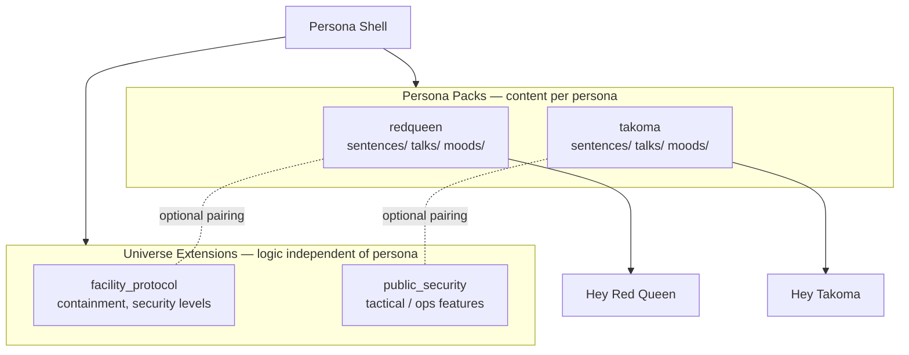

# Persona Shell — Branding & Naming Spec

## Status

Draft branding direction approved in discussion (2026-07-13).  
Supersedes the *marketing layer* of “Project Alice” only; technical migration is phased.

## One-liner

**Persona Shell** is a modular voice personality platform for Home Assistant — a *shell* (container) that loads *personas* and optional *universe extensions* inspired by sci-fi archetypes. Personas and universes are **independent axes**.

| Language | Tagline |
|---|---|
| EN | *A shell for personalities. Pick a persona, enable the protocols you need, speak.* |
| DE | *Eine Hülle für Persönlichkeiten. Persona wählen, Protokolle aktivieren, sprechen.* |

## Name usage

| Context | Use | Avoid |
|---|---|---|
| Project / docs / community | **Persona Shell** | “Ghost in the Assistant”, franchise titles |
| HA integration (current) | **Alice** (`custom_components/alice`) until rename phase | Breaking HACS domain without migration plan |
| HA integration (target) | **Persona Shell** (`custom_components/persona_shell`) | Renaming before alias/shim exists |
| Catalog | **☂ Persona Shell Umbrella** | “Alice Umbrella” in new docs (legacy alias OK) |
| Persona content | **Persona Pack** (one persona per pack) | Bundling multiple personas in one pack |
| Protocol / feature layer | **Universe Extension** (`facility_protocol`, `public_security`, …) | Tying universe IDs to a single persona |

**Article:** Prefer *Persona Shell* without “The” in headings and repo titles; *The Persona Shell* is acceptable in prose.

## Concept hierarchy

Persona and universe are **orthogonal**: the active persona controls voice, mood, and persona-specific phrases; universe extensions control optional protocol features (security routines, tactical helpers, …). Either can be used without the other.

```text
Persona Shell                         ← platform (engine, registry, voice pipeline)
├── Persona Pack (1 pack = 1 persona) ← talks, moods, sentences per persona
│   └── e.g. redqueen/, takoma/
├── Universe Extension (optional)     ← protocol logic; independent of active persona
│   └── e.g. facility_protocol/, public_security/
└── Wakeword Pack (optional)          ← openWakeWord model per persona phrase
```



**Example combinations (all valid):**

| Active persona | Enabled universe extensions | Result |
|---|---|---|
| `redqueen` | `facility_protocol` | Facility-AI voice + containment protocol |
| `takoma` | `facility_protocol` | Playful drone voice + facility lockdown lines from extension |
| `redqueen` | none | Persona only, no protocol extensions |
| `takoma` | `public_security` + `facility_protocol` | Drone persona + both protocol modules |

### Layer definitions

1. **Persona Shell (platform)**  
   RedQueen-style engine, user memory, conversation agent, extension registry, sentence export, optional LLM adapter. Agnostic to persona and universe choice.

2. **Persona Pack**  
   Lightweight package for **exactly one persona**. Own `persona.json`, `sentences/<lang>.yaml`, `talks/<lang>.yaml`, mood list, voice hints. No Python required. This is the unit that owns **per-persona sentences**.

3. **Persona**  
   The selectable character (`persona_style` / `persona_id`): e.g. `redqueen`, `takoma`. Catalog metadata may include a suggested universe tag for discovery only — not a runtime dependency.

4. **Universe Extension**  
   HA custom integration for a **protocol or feature domain** (`facility_protocol`, `public_security`, …). Registers via `persona_shell_extension.json` (alias: legacy `alice_extension.json`). Provides services, entities, and **extension sentences** that merge into Speech-to-Phrase export. **Does not** own persona talks or persona-specific command phrasing.

5. **Wakeword Pack**  
   Trained models + install docs; binds wake phrase → persona / Assist pipeline. Not the same as Speech-to-Phrase sentences.

### Sentence & talk ownership

| Asset | Owned by | Path pattern |
|---|---|---|
| Persona commands & chit-chat | **Persona Pack** | `personas/<persona_id>/sentences/<lang>.yaml` |
| Persona response templates | **Persona Pack** | `personas/<persona_id>/talks/<lang>.yaml` |
| Protocol / security / game commands | **Universe Extension** | `custom_components/<universe_id>/sentences/<lang>.yaml` |
| Aggregated STT export | **Persona Shell** | active persona sentences + enabled extension sentences |

The registry merges on load: `export = base + active_persona.sentences + Σ(enabled_universe_extension.sentences)`.

## Pack, persona & universe naming

### Two independent ID namespaces

| Namespace | ID examples | Role |
|---|---|---|
| **Persona** | `redqueen`, `takoma`, `operator`, `analyst` | Voice, mood, persona sentences & talks |
| **Universe** | `facility_protocol`, `public_security`, `orbital_core` | Optional protocol extensions (logic, entities, extension sentences) |

A persona README may say *“inspired by facility-AI archetypes”* and suggest pairing with `facility_protocol`, but **installing `redqueen` does not enable `facility_protocol`** and vice versa.

### Persona Pack layout (one persona per pack)

```text
persona_redqueen/
  persona.json
  sentences/
    de.yaml
    en.yaml
  talks/
    de.yaml
    en.yaml
  README.md
```

```text
persona_takoma/
  persona.json
  sentences/
    de.yaml
    en.yaml
  talks/
    de.yaml
    en.yaml
  README.md
```

### Universe Extension layout (protocol layer)

```text
custom_components/facility_protocol/
  manifest.json
  persona_shell_extension.json   # legacy alias: alice_extension.json
  sentences/
    de.yaml                      # protocol commands only, e.g. containment
    en.yaml
  ...
```

```text
custom_components/public_security/
  manifest.json
  persona_shell_extension.json
  sentences/
    de.yaml
  ...
```

Today’s **Containment Alarm** maps to universe extension `facility_protocol` (domain may stay `alice_containment_alarm` until migration).

### Catalog reference (discovery, not coupling)

| Universe ID | Display name | Typical pairing (optional) | Provides |
|---|---|---|---|
| `facility_protocol` | Facility Protocol | often used with `redqueen`, `operator` | containment, security levels, lockdown |
| `public_security` | Public Security | often used with `takoma`, `analyst` | tactical / ops helpers (future) |
| `orbital_core` | Orbital Core | calm personas | navigation / ship-log style (future) |

| Persona ID | Display name | Suggested universe (metadata only) |
|---|---|---|
| `redqueen` | Red Queen | `facility_protocol` |
| `operator` | Operator | `facility_protocol` |
| `takoma` | Takoma | `public_security` |
| `analyst` | Analyst | `public_security` |

Legacy mapping:

| Old name | New name |
|---|---|
| Alice base integration | Persona Shell base integration |
| Default Red Queen content | Persona Pack `redqueen` |
| Alice Extension / Containment | Universe Extension `facility_protocol` |
| Alice Pack (multi-persona bundle) | **Split** → one Persona Pack per persona |
| `alice_extension.json` | `persona_shell_extension.json` (+ legacy alias) |
| ☂ Alice Umbrella | ☂ Persona Shell Umbrella |

### Persona IDs

- Short, lowercase, no spaces: `redqueen`, `takoma`, `operator`
- Wakeword phrase may differ: “Hey Red Queen”, “Hey Takoma”
- Display names are Title Case in UI: **Red Queen**, **Takoma**
- Each persona ID is unique across the catalog; never nested under a universe ID in paths or manifests

### Manifest sketch (`persona.json` — one file per persona pack)

```json
{
  "name": "Takoma",
  "id": "takoma",
  "type": "persona_pack",
  "version": "0.1.0",
  "languages": ["de", "en"],
  "suggested_universe": "public_security",
  "provides": ["sentences", "talks", "moods"],
  "persona_shell_min_version": "0.2.0"
}
```

`suggested_universe` is catalog metadata only — not loaded or enforced at runtime.

### Manifest sketch (`persona_shell_extension.json` — universe extension)

```json
{
  "name": "Facility Protocol",
  "id": "facility_protocol",
  "type": "universe_extension",
  "version": "0.1.0",
  "languages": ["de", "en"],
  "provides": ["sentences", "intents", "entities", "services"],
  "persona_shell_min_version": "0.2.0"
}
```

No `personas` array. Universe extensions do not declare or bundle personas.

## Inspiration policy (persona packs & universe extensions)

Same rules as the Alice platform design:

- **Allowed:** archetypes, tone, generic protocol vocabulary, original template lines
- **Not allowed:** copyrighted quotes, logos, character names where legally risky as commercial marks, ripped audio, “official ™” framing
- Packs describe inspiration in README (“facility-AI style”, “tactical drone companion”) not “official Resident Evil / Ghost in the Shell edition”
- `suggested_universe` in a persona pack is a **hint for the umbrella catalog**, not a license bundle

## README rewrite concept (root)

Replace hero + first paragraphs only in phase 1; keep install/history sections until migration completes.

### Proposed hero (EN)

```markdown
# Persona Shell

A modular voice personality platform for Home Assistant.

Persona Shell is the **shell** — the runtime that handles conversation, mood, user memory, and extension registry.  
**Persona packs** add one character each (voice, phrases, moods, **sentences per persona**).  
**Universe extensions** add optional protocol logic (`facility_protocol`, `public_security`, …) **independent of the active persona**.  
**Extensions** may also include games, integrations, and device state.

> Formerly developed as *Project Alice* (Home Assistant port). The `alice` integration domain remains supported during migration.

## Quick concept

| You want… | Use… |
|---|---|
| The platform | Persona Shell integration |
| A character voice & persona commands | One **persona pack** (`redqueen`, `takoma`, …) |
| Protocol features (lockdown, ops, …) | **Universe extension** — any persona can stay active |
| Device / game logic | Persona Shell extension (universe or standalone) |

## Catalog

See [☂ Persona Shell Umbrella](skills/README.md).

| Type | ID | Status |
|---|---|---|
| Persona | `redqueen` | in base / legacy |
| Persona | `takoma` | planned |
| Universe extension | `facility_protocol` (Containment) | in-repo extension |
| Universe extension | `public_security` | planned |
```

### Proposed hero (DE) — optional block in README

```markdown
**Persona Shell** ist die Hülle für KI-Persönlichkeiten in Home Assistant.  
Persona Packs liefern Stil, Sprache und **Sentences pro Persona**; Universe Extensions liefern optionale Protokoll-Logik — unabhängig von der gewählten Persona.
```

### Sections to retain unchanged (phase 1)

- Installing / HACS pointer
- Fork attribution & license
- Hardware notes
- Issue tracker links

### Sections to rename (phase 2)

| Current | Target |
|---|---|
| Alice apps and extensions | Persona Shell persona packs & universe extensions |
| Project Alice, as in Resident Evil | Background: `redqueen` persona + optional `facility_protocol` |
| `custom_components/alice` paths in docs | Dual-path until domain migration |

## Migration path

Phased; no big-bang rename.

### Phase 0 — Branding only (now)

- [ ] Add this spec
- [ ] README subtitle: “Persona Shell (formerly Project Alice)”
- [ ] `skills/README.md`: umbrella rename + legacy note
- [ ] No code/domain changes

### Phase 1 — Vocabulary in docs & catalog

- [ ] Design doc addendum: Persona Shell terminology alongside Alice terms
- [ ] Umbrella catalog: separate tables for **persona packs** and **universe extensions**
- [ ] Containment extension README: universe extension `facility_protocol` (persona-agnostic)

### Phase 2 — Dual aliases in code

- [ ] Accept `persona_shell_extension.json` and `alice_extension.json`
- [ ] Config: `default_persona` (persona axis) separate from enabled universe extensions
- [ ] Sentence export: `active_persona.sentences` + enabled extension sentences
- [ ] Optional entity friendly names: “Persona Shell” in device registry

### Phase 3 — Domain migration (breaking, major version)

- [ ] New domain `persona_shell` with config entry migration from `alice`
- [ ] Deprecation shim: `alice` → `persona_shell` for one major release
- [ ] Update `hacs.json`, manifest, translations
- [ ] GitHub repo display name / docs site (if any)

### Phase 4 — Ecosystem

- [ ] Wakeword pack per persona (“Hey Takoma”, …)
- [ ] Community persona packs (one persona per repo)
- [ ] Community universe extensions in umbrella catalog
- [ ] Template repos: `persona-pack-template`, `universe-extension-template`

## Entity & service naming (target)

| Legacy | Target |
|---|---|
| `conversation.alice` | `conversation.persona_shell` |
| `sensor.alice_mood` | `sensor.persona_shell_mood` |
| `select.alice_persona_style` | `select.persona_shell_persona` |
| `alice.set_mood` | `persona_shell.set_mood` |

During phase 0–2, legacy names remain canonical in code.

## Open decisions

1. **Repo name:** keep `ProjectAlice-HA-unofficial` vs rename to `Persona-Shell-HA` (GitHub redirect?)
2. **Default persona on fresh install:** `redqueen` (continuity) vs persona picker
3. **Single vs multiple conversation agents:** one agent switching persona vs one entity per persona
4. **Wakeword scope:** expand beyond “Hey Alice” / “Hey Red Queen” when persona packs ship
5. **Universe extension enablement:** global config entry vs per-user vs automatic when HACS integration is loaded
6. **Talk routing:** when `facility_protocol` fires containment talks, use active persona’s talk variants or extension-default templates?

## Related documents

- [Alice HA Personality Platform Design](./2026-06-10-alice-ha-personality-platform-design.md) — technical architecture (terminology update pending)
- [Implementation Plan](../plans/2026-07-02-alice-ha-personality-platform.md)
