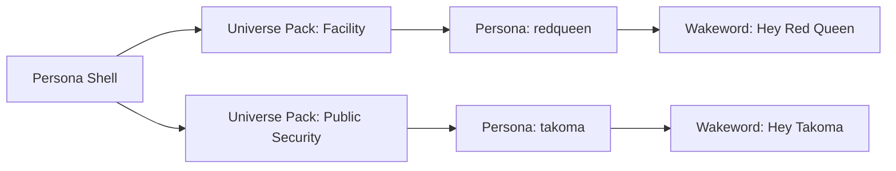

# Persona Shell — Branding & Naming Spec

## Status

Draft branding direction approved in discussion (2026-07-13).  
Supersedes the *marketing layer* of “Project Alice” only; technical migration is phased.

## One-liner

**Persona Shell** is a modular voice personality platform for Home Assistant — a *shell* (container) that loads *personas* from optional *universe packs* inspired by sci-fi archetypes.

| Language | Tagline |
|---|---|
| EN | *A shell for personalities. Load a universe, pick a persona, speak.* |
| DE | *Eine Hülle für Persönlichkeiten. Universe Pack laden, Persona wählen, sprechen.* |

## Name usage

| Context | Use | Avoid |
|---|---|---|
| Project / docs / community | **Persona Shell** | “Ghost in the Assistant”, franchise titles |
| HA integration (current) | **Alice** (`custom_components/alice`) until rename phase | Breaking HACS domain without migration plan |
| HA integration (target) | **Persona Shell** (`custom_components/persona_shell`) | Renaming before alias/shim exists |
| Catalog | **☂ Persona Shell Umbrella** | “Alice Umbrella” in new docs (legacy alias OK) |
| Packs | **Universe Pack** or **Persona Pack** | “Official GiTS/RE edition” |

**Article:** Prefer *Persona Shell* without “The” in headings and repo titles; *The Persona Shell* is acceptable in prose.

## Concept hierarchy

```text
Persona Shell                    ← platform (engine, registry, voice pipeline)
├── Universe Pack              ← themed content bundle (talks, moods, sentences)
│   ├── Persona                ← active character / style (redqueen, takoma, …)
│   └── Extension (optional)   ← HA integration with logic + alice_extension.json
└── Wakeword Pack (optional)   ← openWakeWord models per persona phrase
```



### Layer definitions

1. **Persona Shell (platform)**  
   RedQueen-style engine, user memory, conversation agent, extension registry, sentence export, optional LLM adapter. Universe-agnostic.

2. **Universe Pack**  
   Themed *content* package: `persona_pack.json`, `talks/`, `sentences/`, mood lists, persona metadata. No Python required.

3. **Persona**  
   A selectable character inside a pack: `persona_style` key, default voice hints, mood set, talk variant selection.

4. **Extension**  
   HA custom integration with state/logic (e.g. Containment Mode). Registers via `persona_shell_extension.json` (alias: legacy `alice_extension.json`).

5. **Wakeword Pack**  
   Trained models + install docs; selects Assist pipeline / default persona. Not the same as Speech-to-Phrase sentences.

## Pack & persona naming

### Universe Pack IDs (folder / manifest `id`)

Lowercase snake_case, descriptive, **no franchise trademarks**:

| Pack ID | Display name | Inspiration (not licensed) | Personas |
|---|---|---|---|
| `facility_protocol` | Facility Protocol Pack | facility AI, lockdown, protocols | `redqueen`, `operator` |
| `public_security` | Public Security Pack | tactical drones, section-style ops | `takoma`, `analyst` |
| `orbital_core` | Orbital Core Pack | calm ship computer | `navigator` (future) |

Legacy mapping:

| Old name | New name |
|---|---|
| Alice base integration | Persona Shell base integration |
| Alice Persona Pack / Red Queen default | `facility_protocol` / persona `redqueen` |
| Alice Extension | Persona Shell Extension |
| Alice Pack | Universe Pack or Persona Pack |
| `alice_extension.json` | `persona_shell_extension.json` (+ legacy alias) |
| ☂ Alice Umbrella | ☂ Persona Shell Umbrella |

### Persona IDs

- Short, lowercase, no spaces: `redqueen`, `takoma`, `operator`
- Wakeword phrase may differ: “Hey Red Queen”, “Hey Takoma”
- Display names are Title Case in UI: **Red Queen**, **Takoma**

### Manifest sketch (`persona_pack.json`)

```json
{
  "name": "Public Security Pack",
  "id": "public_security",
  "type": "universe_pack",
  "version": "0.1.0",
  "languages": ["de", "en"],
  "personas": ["takoma", "analyst"],
  "provides": ["talks", "sentences", "moods"],
  "persona_shell_min_version": "0.2.0"
}
```

## Inspiration policy (all universe packs)

Same rules as the Alice platform design:

- **Allowed:** archetypes, tone, generic protocol vocabulary, original template lines
- **Not allowed:** copyrighted quotes, logos, character names where legally risky as commercial marks, ripped audio, “official ™” framing
- Packs describe inspiration in README (“facility-AI style”, “tactical drone companion”) not “official Resident Evil / Ghost in the Shell edition”

## README rewrite concept (root)

Replace hero + first paragraphs only in phase 1; keep install/history sections until migration completes.

### Proposed hero (EN)

```markdown
# Persona Shell

A modular voice personality platform for Home Assistant.

Persona Shell is the **shell** — the runtime that handles conversation, mood, user memory, and extensions.  
**Universe packs** add sci-fi-inspired **personas** (voices, phrases, moods).  
**Extensions** add Home Assistant logic (security routines, games, integrations).

> Formerly developed as *Project Alice* (Home Assistant port). The `alice` integration domain remains supported during migration.

## Quick concept

| You want… | Use… |
|---|---|
| The platform | Persona Shell integration |
| A character voice | A persona inside a universe pack |
| Themed phrases & moods | Universe / persona pack (HACS) |
| Locks, alarms, game state | Persona Shell extension |

## Universe packs (catalog)

See [☂ Persona Shell Umbrella](skills/README.md).

| Pack | Personas | Status |
|---|---|---|
| Facility Protocol | Red Queen, … | in base / legacy |
| Public Security | Takoma, … | planned |
```

### Proposed hero (DE) — optional block in README

```markdown
**Persona Shell** ist die Hülle für KI-Persönlichkeiten in Home Assistant.  
Universe Packs liefern Stil und Sprache; Extensions liefern Logik und Geräte.
```

### Sections to retain unchanged (phase 1)

- Installing / HACS pointer
- Fork attribution & license
- Hardware notes
- Issue tracker links

### Sections to rename (phase 2)

| Current | Target |
|---|---|
| Alice apps and extensions | Persona Shell extensions & universe packs |
| Project Alice, as in Resident Evil | Background: Facility Protocol pack inspiration |
| `custom_components/alice` paths in docs | Dual-path until domain migration |

## Migration path

Phased; no big-bang rename.

### Phase 0 — Branding only (now)

- [ ] Add this spec
- [ ] README subtitle: “Persona Shell (formerly Project Alice)”
- [ ] `skills/README.md`: umbrella rename + legacy note
- [ ] No code/domain changes

### Phase 1 — Vocabulary in docs & catalog

- [ ] Design doc addendum: Persona Shell terminology alongside Alice terms
- [ ] Register universe packs in umbrella catalog with new IDs
- [ ] Containment extension README: “Facility Protocol extension”

### Phase 2 — Dual aliases in code

- [ ] Accept `persona_shell_extension.json` and `alice_extension.json`
- [ ] Config: `default_persona` unchanged; document persona IDs per pack
- [ ] Optional entity friendly names: “Persona Shell” in device registry

### Phase 3 — Domain migration (breaking, major version)

- [ ] New domain `persona_shell` with config entry migration from `alice`
- [ ] Deprecation shim: `alice` → `persona_shell` for one major release
- [ ] Update `hacs.json`, manifest, translations
- [ ] GitHub repo display name / docs site (if any)

### Phase 4 — Ecosystem

- [ ] Wakeword pack per persona (“Hey Takoma”, …)
- [ ] Community universe packs in umbrella catalog
- [ ] Template repository for third-party universe packs

## Entity & service naming (target)

| Legacy | Target |
|---|---|
| `conversation.alice` | `conversation.persona_shell` |
| `sensor.alice_mood` | `sensor.persona_shell_mood` |
| `select.alice_persona_style` | `select.persona_shell_persona` |
| `alice.set_mood` | `persona_shell.set_mood` |

During phase 0–2, legacy names remain canonical in code.

## Open decisions

1. **Repo name:** keep `ProjectAlice-HA-unofficial` vs rename to `Persona-Shell-HA` (GitHub redirect?)
2. **Default persona on fresh install:** `redqueen` (continuity) vs prompt to choose universe pack
3. **Single vs multiple conversation agents:** one agent switching persona vs one entity per persona
4. **Wakeword scope:** expand beyond “Hey Alice” / “Hey Red Queen” when universe packs ship

## Related documents

- [Alice HA Personality Platform Design](./2026-06-10-alice-ha-personality-platform-design.md) — technical architecture (terminology update pending)
- [Implementation Plan](../plans/2026-07-02-alice-ha-personality-platform.md)
