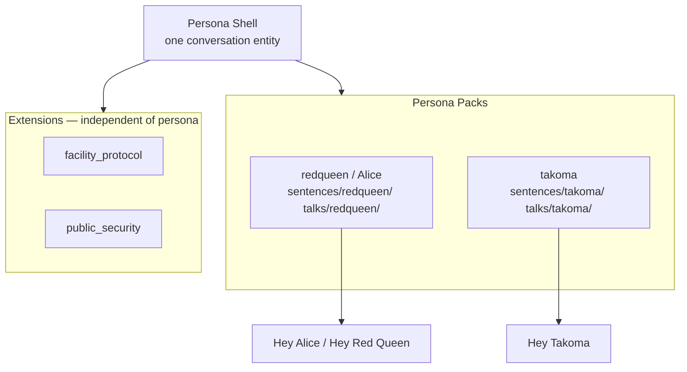

# Persona Shell — Branding & Naming Spec

## Status

Approved branding direction (2026-07-13, updated 2026-07-17).  
Supersedes the *marketing layer* of “Project Alice”. Technical migration remains phased.

## Repository

| Field | Value |
|---|---|
| **GitHub name** | `Persona-Shell-HA` |
| **Display title** | Persona Shell HA |
| **Description** | The Persona Shell is a modular voice personality platform. Load a persona from any sci-fi universe — each pack brings its own voice, mood, and style. The shell stays the same; the personality changes. |
| **Legacy slug** | `ProjectAlice-HA-unofficial` (redirect after rename) |

Rename is a **manual GitHub Settings → Repository name** action. Update HACS URLs, badges, and fork notes after the redirect is live.

## One-liner

**Persona Shell** is a modular voice personality platform for Home Assistant — a *shell* (container) that loads *personas* and optional *extensions*. Personas and extensions are **independent axes**.

| Language | Tagline |
|---|---|
| EN | *A shell for personalities. Pick a persona, enable the features you need, speak.* |
| DE | *Eine Hülle für Persönlichkeiten. Persona wählen, Erweiterungen aktivieren, sprechen.* |

## Resolved decisions

| Topic | Decision |
|---|---|
| Repo name | **Persona Shell HA** (`Persona-Shell-HA`) |
| Fresh install | **Persona picker** in config flow — user chooses default persona |
| Conversation agent | **One** `conversation` entity; persona switches via config / service / per satellite |
| Wakewords | **Per persona pack** — each installed persona may ship its own wakeword model |
| Extension naming | **Extension** only — not “Universe Extension” |
| Sentence paths | `sentences/<persona_id>/<lang>.yaml` — export **only the active persona** |
| Alice vs Red Queen | **Same persona** — `redqueen` is the canonical ID; “Alice” is display name + legacy wakeword alias |

## Name usage

| Context | Use | Avoid |
|---|---|---|
| Project / docs / community | **Persona Shell** / **Persona Shell HA** | “Ghost in the Assistant”, franchise titles |
| HA integration (current) | **Alice** (`custom_components/alice`) until rename phase | Breaking HACS domain without migration plan |
| HA integration (target) | **Persona Shell** (`custom_components/persona_shell`) | Renaming before alias/shim exists |
| Catalog | **☂ Persona Shell Umbrella** | “Alice Umbrella” in new docs (legacy alias OK) |
| Persona content | **Persona Pack** (one persona per pack) | Bundling multiple personas in one pack |
| Feature layer | **Extension** (`facility_protocol`, `public_security`, …) | “Universe Extension”, tying extension IDs to one persona |

**Article:** Prefer *Persona Shell* in headings and repo titles; *The Persona Shell* in GitHub description and prose is fine.

## Alice = Red Queen

The original project name **Alice** refers to the same persona as **Red Queen**:

| Field | Value |
|---|---|
| Canonical `persona_id` | `redqueen` |
| Display names | **Red Queen**, **Alice** (alias) |
| Wakewords | “Hey Red Queen”, “Hey Alice” (both → `redqueen`) |
| Legacy domain / entities | `alice`, `conversation.alice`, … until migration shim |

“Hey Alice” remains a supported wakeword for continuity; it does **not** denote a separate persona.

## Concept hierarchy

Persona and extension are **orthogonal**: the active persona controls voice, mood, and persona-specific phrases; extensions control optional features (security routines, games, integrations). Either can be used without the other.

```text
Persona Shell                         ← platform (engine, registry, voice pipeline)
├── Persona Pack (1 pack = 1 persona) ← talks, moods, sentences/<persona_id>/
│   └── e.g. redqueen, takoma
├── Extension (optional)              ← logic + extension sentences; persona-agnostic
│   └── e.g. facility_protocol, public_security
└── Wakeword Pack (per persona)       ← openWakeWord model per persona phrase
```



**Example combinations (all valid):**

| Active persona | Enabled extensions | Result |
|---|---|---|
| `redqueen` | `facility_protocol` | Red Queen / Alice voice + containment |
| `takoma` | `facility_protocol` | Takoma voice + containment extension sentences |
| `redqueen` | none | Persona only |
| `takoma` | `public_security` + `facility_protocol` | Takoma + both extensions |

### Layer definitions

1. **Persona Shell (platform)**  
   Personality engine, user memory, **one conversation entity**, extension registry, sentence export, optional LLM adapter. Agnostic to persona and extension choice.

2. **Persona Pack**  
   Package for **exactly one persona**: `persona.json`, `sentences/<persona_id>/<lang>.yaml`, `talks/<persona_id>/<lang>.yaml`, moods, voice hints, optional wakeword metadata. No Python required.

3. **Persona**  
   Selectable character (`persona_id`): e.g. `redqueen`, `takoma`. Installed packs register available personas; config flow picker sets household default.

4. **Extension**  
   HA custom integration for features (`facility_protocol`, containment, games, …). Registers via `persona_shell_extension.json` (alias: `alice_extension.json`). Provides services, entities, extension sentences. **Does not** own persona talks.

5. **Wakeword Pack**  
   Per persona — trained model + metadata. Wake phrase selects Assist pipeline and may set active persona on that satellite.

### Conversation entity & per-device persona

- **One** `conversation.persona_shell` entity (legacy: `conversation.alice`).
- Household **default persona** from config flow on first install.
- **Per satellite / media player / area:** override active persona (e.g. kitchen → `takoma`, office → `redqueen`) while sharing one agent.
- Wakeword on a device may also bind persona for that pipeline.

### Sentence & talk ownership

| Asset | Owned by | Path pattern |
|---|---|---|
| Persona commands & chit-chat | **Persona Pack** | `sentences/<persona_id>/<lang>.yaml` |
| Persona response templates | **Persona Pack** | `talks/<persona_id>/<lang>.yaml` |
| Feature / protocol commands | **Extension** | `custom_components/<extension_id>/sentences/<lang>.yaml` |
| Aggregated STT export | **Persona Shell** | **active persona only** + enabled extension sentences |

**Export rule:**

```text
export(lang) = base_shell_sentences(lang)
             + sentences/<active_persona_id>/<lang>.yaml
             + Σ(enabled_extension.sentences/<lang>.yaml)
```

Inactive persona sentence files are **not** written to `/config/custom_sentences/`. Re-export when the active persona or extension set changes.

## Pack, persona & extension naming

### Two independent ID namespaces

| Namespace | ID examples | Role |
|---|---|---|
| **Persona** | `redqueen`, `takoma`, `operator`, `analyst` | Voice, mood, persona sentences & talks |
| **Extension** | `facility_protocol`, `public_security`, `alice_containment_alarm` | Optional features, entities, extension sentences |

Installing `redqueen` does **not** enable `facility_protocol`. Enabling an extension does **not** change the active persona.

### Persona Pack layout

```text
persona_redqueen/
  persona.json
  sentences/
    redqueen/
      de.yaml
      en.yaml
  talks/
    redqueen/
      de.yaml
      en.yaml
  wakeword/                    # optional
    hey-alice.onnx
    hey-red-queen.onnx
  README.md
```

```text
persona_takoma/
  persona.json
  sentences/
    takoma/
      de.yaml
      en.yaml
  talks/
    takoma/
      de.yaml
      en.yaml
  wakeword/
    hey-takoma.onnx
  README.md
```

When packs are merged into the shell catalog, paths stay **`sentences/<persona_id>/<lang>.yaml`** so each persona remains addressable and only the active one is exported.

### Extension layout

```text
custom_components/facility_protocol/
  manifest.json
  persona_shell_extension.json   # legacy alias: alice_extension.json
  sentences/
    de.yaml
    en.yaml
  ...
```

Today’s **Containment Alarm** is extension `facility_protocol` (domain may stay `alice_containment_alarm` until migration).

### Catalog reference (discovery only)

| Extension ID | Display name | Provides |
|---|---|---|
| `facility_protocol` | Facility Protocol | containment, security levels, lockdown |
| `public_security` | Public Security | tactical / ops helpers (future) |

| Persona ID | Display names | Wakewords (examples) |
|---|---|---|
| `redqueen` | Red Queen, **Alice** | Hey Red Queen, **Hey Alice** |
| `takoma` | Takoma | Hey Takoma |
| `operator` | Operator | Hey Operator (future) |

### Legacy mapping

| Old name | New name |
|---|---|
| Project Alice | Persona Shell HA |
| Alice (character) | Persona `redqueen` (display: Red Queen / Alice) |
| Alice base integration | Persona Shell base integration |
| Alice Extension / Containment | Extension `facility_protocol` |
| Alice Pack (multi-persona) | One persona pack per persona |
| `alice_extension.json` | `persona_shell_extension.json` (+ legacy alias) |
| ☂ Alice Umbrella | ☂ Persona Shell Umbrella |

### Manifest sketch (`persona.json`)

```json
{
  "name": "Takoma",
  "id": "takoma",
  "type": "persona_pack",
  "version": "0.1.0",
  "languages": ["de", "en"],
  "wakewords": ["Hey Takoma"],
  "provides": ["sentences", "talks", "moods", "wakeword"],
  "persona_shell_min_version": "0.2.0"
}
```

```json
{
  "name": "Red Queen",
  "id": "redqueen",
  "type": "persona_pack",
  "version": "0.1.0",
  "languages": ["de", "en"],
  "display_names": ["Red Queen", "Alice"],
  "wakewords": ["Hey Red Queen", "Hey Alice"],
  "provides": ["sentences", "talks", "moods", "wakeword"],
  "persona_shell_min_version": "0.2.0"
}
```

### Manifest sketch (`persona_shell_extension.json`)

```json
{
  "name": "Facility Protocol",
  "id": "facility_protocol",
  "type": "extension",
  "version": "0.1.0",
  "languages": ["de", "en"],
  "provides": ["sentences", "intents", "entities", "services"],
  "persona_shell_min_version": "0.2.0"
}
```

No `personas` array. Extensions do not bundle personas.

## Wakewords

- **Per persona pack** — each pack may ship one or more models (e.g. `redqueen`: Hey Alice + Hey Red Queen).
- Wakeword selects the Assist pipeline and should align active persona on that device.
- Installing a persona pack does not require its wakeword; user enables models in openWakeWord separately.
- Design no longer limits wakewords to “Hey Alice” / “Hey Red Queen” only when persona packs ship.

## Fresh install — persona picker

Config flow on first setup:

1. Install Persona Shell integration.
2. **Choose default persona** from installed persona packs (preinstalled: `redqueen` / Alice).
3. Optional: install more persona packs from HACS before completing setup.
4. Set language, sarcasm, ambient chatter, etc.

No implicit default without user confirmation — but `redqueen` is preselected if only one pack is present.

## Inspiration policy

Same rules as the Alice platform design:

- **Allowed:** archetypes, tone, generic protocol vocabulary, original template lines
- **Not allowed:** copyrighted quotes, logos, risky commercial character marks, ripped audio, “official ™” framing
- Describe inspiration in README, not as licensed franchise editions

## README rewrite concept (root)

### Proposed hero (EN)

```markdown
# Persona Shell

The Persona Shell is a modular voice personality platform. Load a persona from any sci-fi universe — each pack brings its own voice, mood, and style. The shell stays the same; the personality changes.

Built for Home Assistant. Formerly *Project Alice* — `alice` integration domain supported during migration.

## Quick concept

| You want… | Use… |
|---|---|
| The platform | Persona Shell integration |
| A character (voice, mood, commands) | **Persona pack** — `redqueen` (Alice), `takoma`, … |
| Security, games, integrations | **Extension** — independent of active persona |
| Different persona per room | One conversation agent, per-device persona override |

## Catalog

See [☂ Persona Shell Umbrella](skills/README.md).
```

### Proposed hero (DE)

```markdown
**Persona Shell** — modulare Sprach-Persönlichkeitsplattform für Home Assistant.  
Persona Packs liefern Stimme, Stimmung und Sentences pro Persona (`sentences/<persona>/<sprache>.yaml`).  
Extensions liefern optionale Logik — unabhängig von der gewählten Persona.
```

## Migration path

### Phase 0 — Branding (in progress)

- [x] Branding spec
- [ ] GitHub repo rename → `Persona-Shell-HA` + description
- [ ] README hero + subtitle
- [ ] `skills/README.md`: umbrella rename
- [ ] No breaking code/domain changes yet

### Phase 1 — Docs & catalog

- [ ] Design doc addendum: Persona Shell terms + Alice = `redqueen`
- [ ] Umbrella catalog: persona packs vs extensions
- [ ] Containment README: extension `facility_protocol`

### Phase 2 — Runtime behavior

- [ ] Config flow: persona picker on install
- [ ] `persona_shell_extension.json` + `alice_extension.json` alias
- [ ] Sentence export: active persona path only + extensions
- [ ] Per-device persona override
- [ ] `alice.set_active_persona` / `persona_shell.set_active_persona` service

### Phase 3 — Domain migration (major)

- [ ] Domain `persona_shell` + migration from `alice`
- [ ] `hacs.json`, manifest, translations
- [ ] Deprecation shim one major release

### Phase 4 — Ecosystem

- [ ] Wakeword pack per persona pack
- [ ] Community persona packs + extensions
- [ ] Template repos: `persona-pack-template`, `extension-template`

## Entity & service naming (target)

| Legacy | Target |
|---|---|
| `conversation.alice` | `conversation.persona_shell` |
| `sensor.alice_mood` | `sensor.persona_shell_mood` |
| `select.alice_persona_style` | `select.persona_shell_persona` |
| `alice.set_mood` | `persona_shell.set_mood` |
| — | `persona_shell.set_active_persona` (per device / area / default) |

During phase 0–2, legacy `alice` names remain canonical in code.

## Open decisions

1. **Talk routing:** when `facility_protocol` fires containment talks, use active persona’s talk variants or extension-default templates?
2. **Extension enablement:** global config vs automatic when HACS integration loads?
3. **Per-device persona binding:** entity attribute on satellite, area config, or Assist pipeline profile?

## Related documents

- [Alice HA Personality Platform Design](./2026-06-10-alice-ha-personality-platform-design.md) — technical architecture (terminology update pending)
- [Implementation Plan](../plans/2026-07-02-alice-ha-personality-platform.md)
